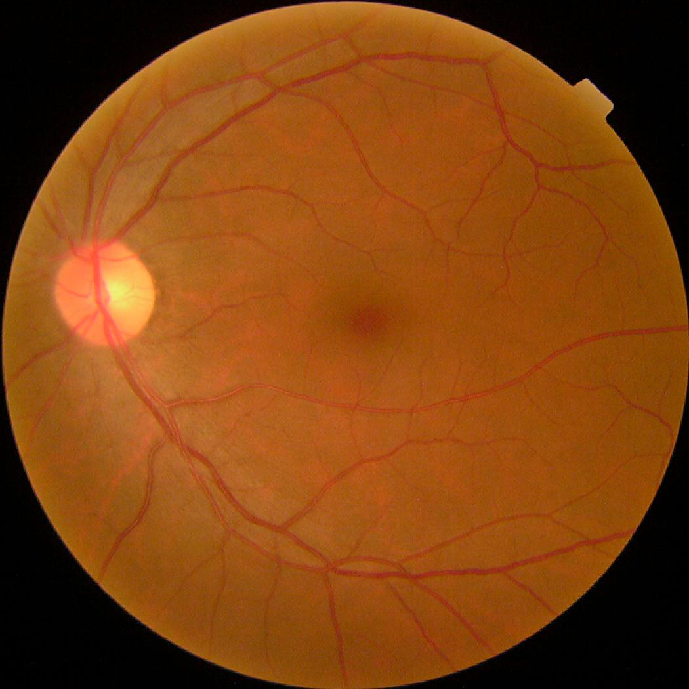
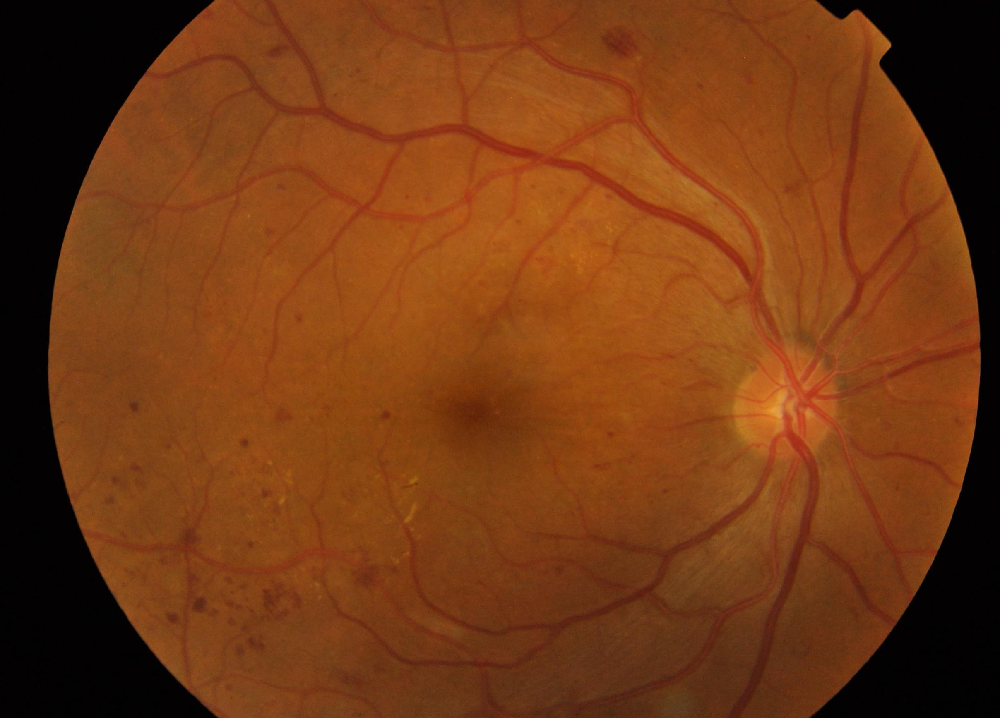

# Diabetic Retinopathy Classifier

This repository is aim to classify fundus images into 5 category of diabetic retinopathy

# Dataset
Dataset is downloaded from kaggle. The link is [here](https://www.kaggle.com/c/aptos2019-blindness-detection).
It contains 3662 train data and 1928 test data.

<table>
<tr>
<td>  </td>
<td> </td>
</tr>
</table>


# How to Run
`python3 train.py -h`

```
usage: train.py [-h] -e EPOCH [-b BATCH_SIZE] -opt OPTIMIZER [-t TRANSFER] -l
                LOSS -act ACTIVATION

optional arguments:
  -h, --help            show this help message and exit
  -e EPOCH, --epoch EPOCH
                        training epoch
  -b BATCH_SIZE, --batch_size BATCH_SIZE
                        training batch size
  -opt OPTIMIZER, --optimizer OPTIMIZER
                        optimizer for compile model option: sgd, adam,
                        rmsprop, adagrad
  -t TRANSFER, --transfer TRANSFER
                        transfer learning pretrain model, option: vgg16,
                        vgg19, resnet50
  -l LOSS, --loss LOSS  training loss to compile option:
                        categorical_crossentropy, binary_crossentropy
  -act ACTIVATION, --activation ACTIVATION
                        training loss to compile, option: tanh, relu, sigmoid

```
## Example
With simple architecture

`python3 train.py -e 3 -opt adam -l binary_crossentropy -act relu`

With Transfer learning VGG19

`python3 train.py -e 3 -opt adam -l binary_crossentropy -act relu -t vgg19` 


# Todo
- add readme ✅
- implement transfer learning ✅
- implement hyperparameter tuning ✅