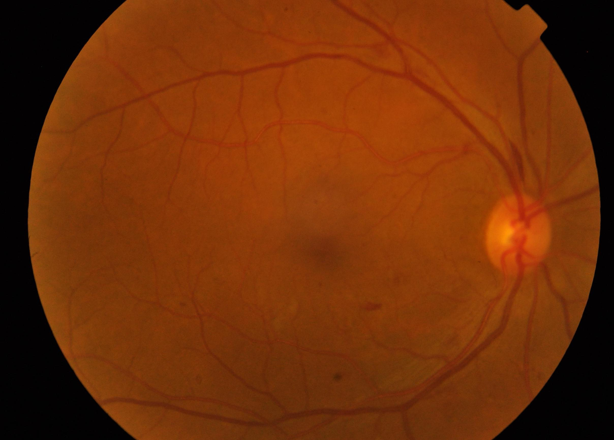

# Diabetic Retinopathy Classifier

This repository aims to classify fundus images into 5 categories of diabetic retinopathy

# Dataset
Dataset is downloaded from kaggle. The link is [here](https://www.kaggle.com/c/aptos2019-blindness-detection).
It contains 3662 train data and 1928 test data.

# To-do
- add readme ✅
- implement transfer learning
- implement hyperparameter tuning 
